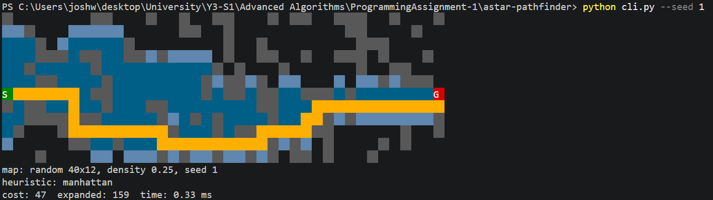

# PA1 Report — A* Pathfinding

## (a) What I built

I implemented A* search on a 2D grid, with 4-way movement (up, down, left,
right) and a uniform cost of 1 per step, wrapped in an animated command-line
tool that visualises the search as it runs.

**Language.** I used Python. I originally planned C#, which is my strongest
language, but switched because Python is simple to work with for
algorithm-heavy code like this, and I already use it for LeetCode-style
problems. Its built-in `heapq` module also provides the priority queue A*
needs.

**Interface.** I chose an animated terminal interface over a GUI. A GUI
would have been nicer to use, but it would have taken more time than I had.
My first plan, Windows Forms, also only runs on Windows, whereas a terminal
program runs on any platform. The terminal version uses ANSI escape codes
to colour cells and redraws each frame in place to animate.

**Representation.** Each cell is an `(x, y)` tuple. This is the natural
Python choice: tuples work directly as dictionary keys and set members. The
alternative, a flat integer index (`y * width + x`), would have meant
converting back to coordinates every time the heuristic ran.

**Structure.** The code is split into modules, each with one job:
`grid.py` (the map and legal moves), `heuristics.py`, `search.py` (A*
itself), `render.py` (drawing and animation), and `generate.py` (random
maps), with `cli.py` as the entry point. This keeps each file small and
readable. It also means the search contains no display code, the tests
only need the core modules, and swapping heuristics requires no change to
the algorithm.

**Design decisions relative to the textbook version.**

- *Priority queue with duplicate entries.* Textbook A* often assumes a
  "decrease-key" operation to lower a cell's priority when a cheaper route
  is found. Python's `heapq` doesn't support this, so instead the code
  pushes a second copy of the cell with its new, lower priority. When a
  cell comes off the heap, it's skipped if it's already been processed,
  which discards the out-of-date copy.
- *Event log for animation.* The search runs to completion without pausing,
  recording each cell as it is discovered or processed. The animation
  replays this log afterwards. This keeps the algorithm a plain loop with
  no display logic mixed in.
- *Extra heuristics for comparison.* Besides Manhattan distance, the tool
  includes Euclidean distance, a zero heuristic (which turns A* into
  Dijkstra's algorithm), and a deliberately overestimating heuristic, which
  demonstrates what happens when A*'s correctness condition is broken.

**Simplifications.** I left out diagonal movement and varied terrain costs
to keep the scope manageable. Diagonal movement would also have required a
different heuristic: with diagonal moves, Manhattan distance overestimates
the true cost, which would make A* return incorrect paths. Terrain costs
could be added later by changing a single method, `Grid.cost`.

## (b) The tool

**What it does.** The tool finds the shortest path between a start and a
goal on a grid map, and animates the search in the terminal as it happens.
Maps are either generated randomly or loaded from a text file. The tool can
run a single heuristic with animation, or compare every heuristic on the
same map in a table.

**How the algorithm sits inside it.** A* lives entirely in
`astar/search.py`, as the function `find_path`. It takes a grid, a start, a
goal, and a heuristic, and returns a result object containing the path, its
cost, the number of cells expanded, the time taken, and an event log. The
rest of the tool is built around that one call: `cli.py` builds the map and
calls `find_path`, and `render.py` turns the result into coloured terminal
output. Because the search never draws anything, the same function serves
the animation, the comparison table, and the tests.

**Interface decisions.**

- *Animation.* This is the most useful feature. Watching the search spread
  makes the difference between heuristics visible in a way the numbers
  alone don't: with Manhattan distance the search heads towards the goal,
  while with the zero heuristic (Dijkstra) it spreads out evenly in every
  direction. Colour shows each cell's state: dark blue cells have been
  expanded, light blue cells have been discovered but not yet expanded,
  and the final path is drawn in orange.
- *A `--compare` mode.* Running every heuristic on one map and printing
  cost, cells expanded, and time side by side makes the comparison
  immediate. It also checks each result against Dijkstra's, which is always
  optimal, and flags any heuristic that returned a longer path.
- *Reproducible maps.* Every random map comes from a seed, and the tool
  prints the seed on every run, so any interesting map can be recreated
  exactly with `--seed`.
- *Hand-made map files* for scenarios random generation won't reliably
  produce: an open field, a U-shaped trap, and a goal that can't be
  reached.
- *Speed controls.* `--delay` and `--steps` control the animation speed,
  and `--no-animate` skips it entirely.
- *Fitting the screen.* The animation redraws each frame in place, which
  only works if the whole map fits in the terminal. If it doesn't, the tool
  prints the final frame instead and explains why, rather than producing
  a scrolling mess.
- *Clear errors* for a missing file, an invalid map, or out-of-range
  options.

**Worked example.** Comparing every heuristic on random map seed 1:

    $ python cli.py --seed 1 --compare
    map: random 40x12, density 0.25, seed 1

    heuristic     cost  expanded   time (ms)  optimal?
    --------------------------------------------------
    manhattan       47       159        0.43  yes
    euclidean       47       235        0.56  yes
    zero            47       321        0.70  yes
    over            51        72        0.24  NO (+4)

All three admissible heuristics find the optimal path of cost 47, but
Manhattan expands about half as many cells as the zero heuristic
(159 vs 321). The overestimating heuristic expands the fewest cells of all,
but returns a path 4 steps longer than optimal.

## (c) What I learned

**I thought A* changed the edge weights.** While learning A*, I watched a
video that explained it by imagining every edge in the graph being
reweighted, so that moves towards the goal become cheaper and moves away
become more expensive, and then running Dijkstra's algorithm on the result.
I came away thinking my implementation would need to change the edge
weights. It doesn't: every step in my grid still costs 1. The video's
reweighting is a way of explaining why A* works, and it collapses into a
single line of code, the priority used when a cell is added to the heap,
`f = g + h`. Nothing else in the algorithm changes, which I found
surprising given how different A* and Dijkstra seemed at first.

**I didn't understand how the heuristic could "know" the distance to the
goal.** The whole point of the search is to find that distance, so it
seemed circular for the algorithm to already have an estimate of it. The
answer is that the heuristic answers a different, easier question: how far
the goal would be if there were no walls. Manhattan distance is just the
difference in columns plus the difference in rows, which takes constant
time to compute. Walls can only make a route longer, never shorter, so this
estimate can never be too high. That is exactly what "admissible" means,
and it's why A* still finds the shortest path.

**A* doesn't always beat Dijkstra.** I expected A* to always do less work
than Dijkstra. On my first test map, a 5x5 grid, Manhattan distance and the
zero heuristic (Dijkstra) both expanded all 19 open cells: the heuristic
did nothing at all. Testing on more maps showed that how much it helps
depends on the map:

| Map | Manhattan expanded | Zero expanded | Dijkstra's extra work |
|---|---|---|---|
| Open field | 113 | 295 | about 2.6x |
| Random, seed 1 | 159 | 321 | about 2.0x |
| U-shaped trap | 193 | 278 | about 1.4x |
| No path to goal | 295 | 295 | none |

The heuristic helps most when the straight-line route is mostly clear,
because then its estimate is close to the real distance. In the U-trap it
points straight at a wall, so A* fills the inside of the U before finding
the way around. When there's no path at all, every heuristic has to expand
every reachable cell, because proving there's no route means checking all
of them. On the 5x5 map, the walls formed corridors where nearly every
cell was on some shortest route, so there was nothing for the heuristic to
rule out.

**What I understand now.** A* is Dijkstra's algorithm with one change:
instead of always processing the cell closest to the start, it processes
the cell whose distance from the start plus its estimated distance to the
goal is smallest. The heuristic doesn't change the answer, as long as it
never overestimates. It only changes how much of the map gets explored on
the way.

## (d) AI use

**Tools and how much.** I used Claude (Anthropic) throughout the project,
heavily. 

**What I used it for.**

- *Choosing the topic and track.* I discussed several options with Claude
  before settling on A* for Track B.
- *Learning the algorithm.* Claude recommended explanation videos and an
  interactive article, and answered my questions when I got confused,
  such as how the heuristic can estimate a distance the search hasn't
  found yet.
- *Writing code.* I pair programmed the algorithm with claude going back and forth until we finised.
  After that, I asked Claude to write most of the code: the
  rendering, animation, map generation, command-line interface,
  tests, and README. I ran everything myself, reported problems back,
  and worked through each file to understand it.
- *The report.* I wrote short notes for each section, such as my reasons
  for each design decision and the things I had misunderstood, and Claude
  expanded them into prose. I checked each section for accuracy and
  corrected anything that wasn't true to my experience.

**Where the AI was wrong or unhelpful.**

1. *It contradicted its own file structure.* Claude gave me a project
   layout with separate files for the grid, heuristics, and search, then
   wrote code that didn't follow it: the heuristics were inside
   `search.py`, and a test script assumed all the files sat in one flat
   folder. I noticed the test script didn't match the layout and pointed
   it out. Claude then split the heuristics into their own file.
2. *The animation code had display bugs I found by running it.* On a small
   map, the final stats line printed on the same line as the goal cell,
   and a leftover fragment of my command stayed at the top of the screen.
   On a larger random map, the output became dozens of stacked copies of
   the grid. The cause was that the animation redraws by moving the cursor
   to the top of the visible window, which only works if the whole map
   fits on screen. The code assumed it would, and nothing checked. I fixed
   it by shrinking the map, and the final CLI now checks the terminal size
   and falls back to printing just the final frame.
3. *A wrong prediction about the algorithm.* Claude told me that deleting
   the line that skips out-of-date heap entries would make the search
   noticeably slower, and suggested using it for the "what breaks" part of
   my video. When tested, the path cost never changed across 200 random
   maps, the extra work was small, and on the map I planned to demo it
   made no difference at all. I used the overestimating heuristic for that
   demo instead, since it visibly returns a wrong answer.

**What I understood vs what I took on trust.**

I understand the algorithm itself: the A* loop in `search.py`, what `g`,
`h`, and `f` are, why the priority queue sorts by `f`, why a cell can
appear in the heap more than once and why the closed check makes that
safe, how the path is rebuilt from `came_from`, and why an overestimating
heuristic returns wrong paths. I also understand the heuristics, and I
wrote the grid's bounds check myself.

I took almost everything else on trust: the rendering and animation code,
the command-line interface, random map generation, map file parsing, and
the tests. I know what each part does and have run all of it to confirm it
works, but I couldn't explain those files line by line or write them
myself without help.

## Resources used

**Red Blob Games, "Introduction to the A\* Algorithm" (Amit Patel)**
<https://www.redblobgames.com/pathfinding/a-star/introduction.html>

This was the biggest help in understanding the algorithm. Rather than
starting with A*, it builds up to it step by step: first breadth-first
search, then Dijkstra's algorithm, which adds movement costs, then greedy
best-first search, which heads straight for the goal, and finally A*,
which combines the last two. Each step fixes a problem with the one before,
so by the time A* appears it feels like the obvious next step rather than
a formula to memorise. The interactive diagrams, where you can drag the
start and goal around and watch each algorithm explore, made the
difference between them easy to see. It's also where I first understood
why greedy best-first search can return a longer path than necessary.

**The A\* video linked in the assignment brief**
<https://www.youtube.com/watch?v=A60q6dcoCjw>

This video explains A* by imagining the edges of the graph being
reweighted so that moves towards the goal become cheaper, and then running
Dijkstra's algorithm on the result. It gave me a deeper explanation of why
an overestimating heuristic breaks A*: overestimating creates negative
edge weights in the reweighted graph, and Dijkstra's algorithm doesn't work
with negative edges. However, it also caused the misunderstanding I
describe in section (c), where I thought my code would need to change the
edge weights. It was most useful after I already understood the basics
from Red Blob Games.